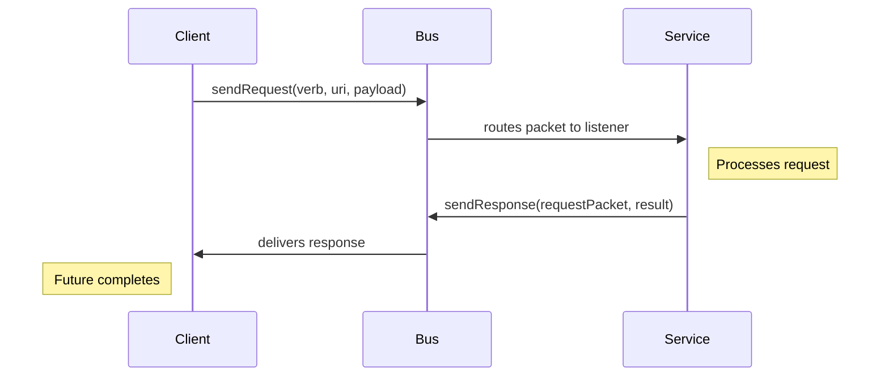
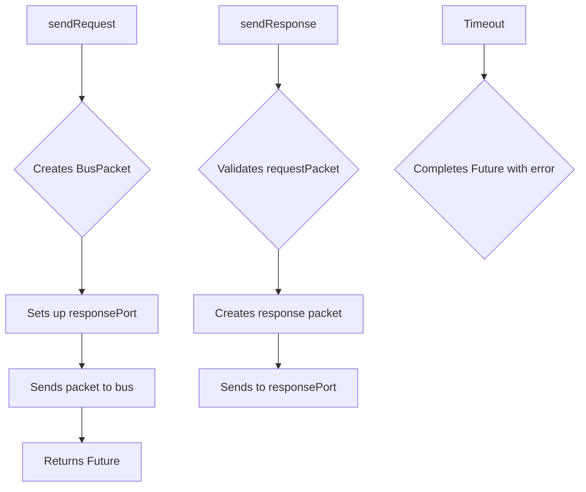

# Request/Response Pattern in SystemBus

> The request/response pattern provides a standardized way for peers to communicate in a question-answer format while maintaining the protocol-agnostic nature of SystemBus.

## Core Principles

* **Protocol Agnostic**: The base `BusPacket` keeps `responsePort` nullable to support various communication patterns
* **Pattern Contract**: The request/response API enforces the contract programmatically
* **Explicit Intent**: Methods clearly indicate the communication pattern being used

## API Design

```dart
// Sending a request (responsePort is mandatory)
Future<dynamic> sendRequest({
  required Enum verb,
  required Uri uri,
  dynamic payload,
  Duration? timeout,
});

// Sending a response (requires original request packet)
void sendResponse(
  BusPacket requestPacket,
  dynamic result, {
  bool success = true,
  String? errorMessage,
});
```

## Flow Diagram



## Implementation Guarantees

* `sendRequest()` ensures a response channel is created
* `sendResponse()` validates the request packet has a responsePort
* Timeout handling is built into the request flow
* Error propagation is standardized

## Usage Example

```dart
// Client side
try {
  final result = await bus.sendRequest(
    verb: HttpVerb.get,
    uri: Uri.parse('bus://device:1/status'),
    payload: {'detail': true},
  );
  print('Got result: $result');
} catch (e) {
  print('Request failed: $e');
}

// Service side
deviceListener.listen((packet) {
  if (packet.verb == HttpVerb.get && packet.uri.path == '/status') {
    try {
      final status = getDeviceStatus(packet.payload?['detail'] ?? false);
      bus.sendResponse(packet, status);
    } catch (e) {
      bus.sendResponse(packet, null, success: false, errorMessage: e.toString());
    }
  }
});
```

## Benefits Over Manual Implementation

> Using the dedicated API instead of manually handling responsePort provides several advantages:

* **Error Handling**: Consistent error propagation
* **Timeout Management**: Automatic request timeouts
* **Contract Enforcement**: Ensures the request/response contract is followed
* **Code Clarity**: Makes the intent of the communication explicit

## Internal Architecture



## Implementation Tasklist for v0.4.0

- [x] **Core API Methods**
  - [x] Add `sendRequest()` method to `SystemBus` class
  - [x] Add `sendResponse()` method to `SystemBus` class
  - [x] Implement timeout handling in request method
  - [x] Add validation for response packets

- [x] **Error Handling**
  - [x] Define error cases (missing responsePort, timeout, etc.)
  - [x] Implement consistent error propagation
  - [x] Add appropriate logging

- [x] **Testing**
  - [x] Unit tests for request/response methods
  - [x] Integration tests for end-to-end communication
  - [x] Edge case tests (timeouts, errors, etc.)

- [x] **Documentation**
  - [x] Update class documentation with new methods
  - [x] Add examples to README
  - [x] Update CHANGELOG for version 0.4.0

- [x] **Release**
  - [x] Version bump to 0.4.0
  - [x] Ready for publication (dry-run successful) 